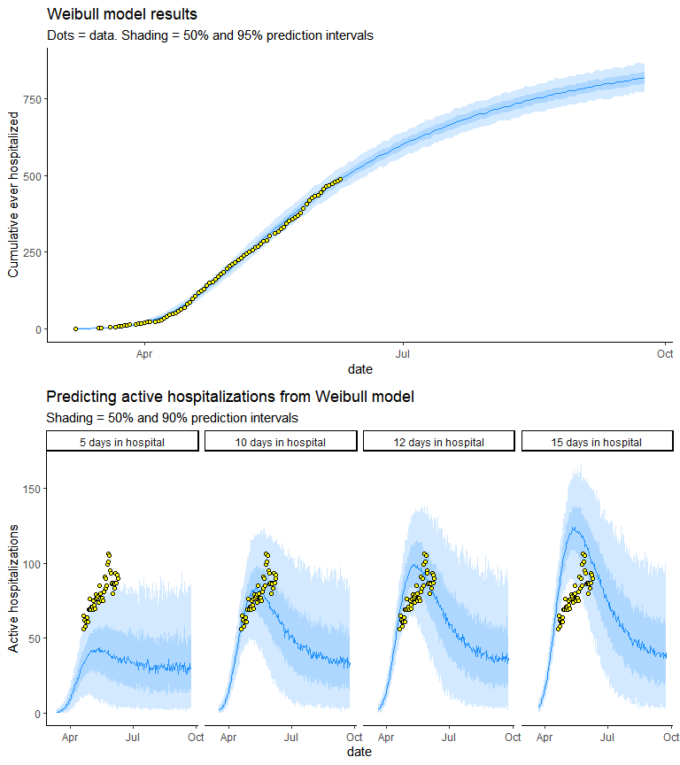

COVID-19 modeling in South Dakota
================
May 18, 2020

# Authors

*Jeff Wesner, Ph.D.*1, *Dan Van Peursem, Ph.D.*2,
*Jose Flores, Ph.D.*2,3, *Yuhlong Lio, Ph.D.*2

University of South Dakota

1Department of Biology, 2Department of
Mathematical Sciences, 3Department of Computer Science

<Jeff.Wesner@usd.edu>

# Purpose

To predict hospital bed needs, ICU needs, and ventilator needs in South
Dakota due to COVID-19.

# Updates

# Alternative Approach

## Directly modeling hospital bed use

Our previous approach attempted to estimate hospital bed use from an
initial SIR
(<https://github.com/jswesner/covid_sd/blob/master/code/alternative_analysis.pdf>).
However, there is now enough data to directly model the curve of
cumulative COVID related hospitalizations. To do that, we first used the
Weibull equation to fit a Bayesian non-linear curve to cumulative
hospitalization data (first graph below). We then converted that
cumulative prediction to active hospitalizations by varying the days in
the hospital to fit the data on active hospitalizations.

<!-- -->

Prior values for are loosely derived from from New York City’s
hospitalization curve in which \~ 0.4% of the population was
hospitalized. We also bounded the proportion of hospitalizations at zero
to prevent predictions of negative hospitalizations.

## Weibull results

Results from the model suggest that South Dakota either has or shortly
will reach its peak in COVID-related hospitalizations at \~80 people
actively hospitalized.

<!-- -->

## Influence of the priors

The plot below compares the prior predictive distribution (i.e. running
the model with only the prior information, not the data) to the
posterior predictive distribution. The large difference in these
predictions indicates that we learned a lot of information from the data
and the priors have relatively small influences.

<!-- -->

## Outside of Sioux Falls

Sioux Falls, SD had the earliest large outbreak in South Dakota. To
determine how COVID19-related hospitalizations differed in Sioux Falls
and outside of Sioux Falls, we ran the model above separately - once for
Minnehaha County (where Sioux Falls is located) and once for all other
areas of the state. The results are plotted below. They suggested that
Minnehaha County is near or past its peak hospitalizations, but that the
rest of South Dakota might not peak until mid-late summer or later.

<!-- -->
