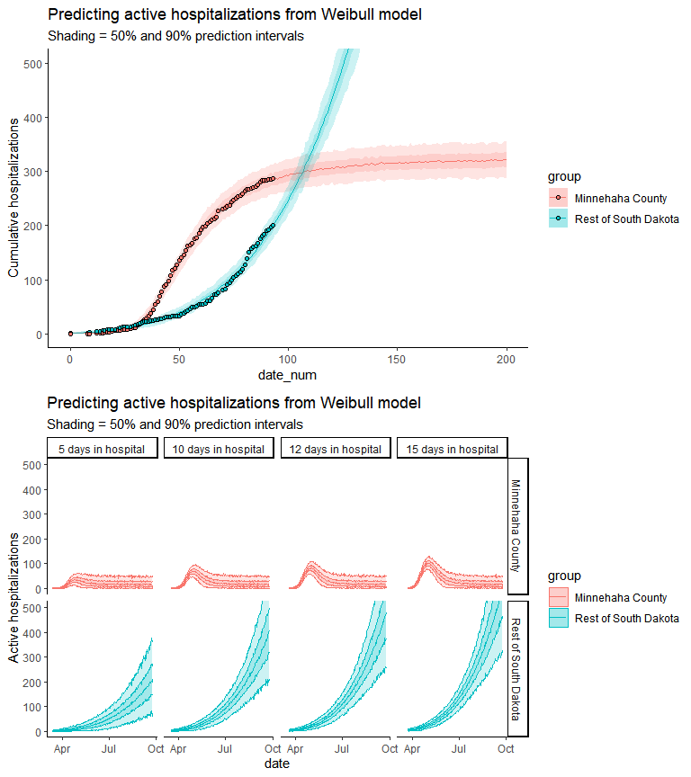

COVID-19 modeling in South Dakota
================
May 08, 2020

# Authors

*Jeff Wesner, Ph.D.*1, *Dan Van Peursem, Ph.D.*2,
*Jose Flores, Ph.D.*2,3, *Yuhlong Lio, Ph.D.*2

University of South Dakota

1Department of Biology, 2Department of
Mathematical Sciences, 3Department of Computer Science

<Jeff.Wesner@usd.edu>

# Purpose

To predict hospital bed needs, ICU needs, and ventilator needs in South
Dakota due to COVID-19.

# Updates

\*We updated the model from previous versions by 1) varying generation
times in each simulation and 2) varying hospitalization rates, icu
rates, and ventilator rates in each simulation. Previous versions of
this model assumed fixed rates for these parameters. Future updates will
be also include varying R0, since it has become clear that the initial
exponential growth in cases has slowed (but then risen again most
recently).

# General Approach and Justification

We estimated R0 from current incidence rates in South Dakota. We then
fit SIR models using our estimates of R0 and compared model predictions
to actual values of hospitalizations reported by the South Dakota
Department of Health (data source:
<https://www.keloland.com/keloland-com-original/why-south-dakotas-number-of-deaths-isnt-always-up-to-date/>.
We chose this approach because it does not rely on external estimates of
R0, but instead derives them from data specific to South Dakota.

Because our estimates of R0 are derived from reported incidence data,
they reflect any day-to-day adjustments in R0 due to social distancing
(with an unknown lag time). In other words, as social distancing reduces
incidence, that will be reflected in our estimates of R0. It is worth
noting that reported incidence is almost certainly lower than true
incidence. However, this does not alter our estimates of R0, assuming
that the rate of underreporting is constant across time.

At present, we are limiting the estimate of R0 to the first 50 days of
incidence data. That captures the positive growth period in incidence so
far, but will need to be adjusted for future variations.

# Derivation of R0

We used the following equation to estimate R0 (eqn 3.1 in Wallinga and
Lipsitch 2007)
<https://www.ncbi.nlm.nih.gov/pmc/articles/PMC1766383/?report=reader#!po=83.3333>:

<!-- -->

where 1/b is the generation time (aka serial interval) in days, and *r*
is the slope of a linear regression between daily incidence and time.
This approach is recommended during the initial phase of an epidemice
when growth is approximately log-linear.

We estimated a posterior distribution of *r* using reported incidence
data in the following regression:

<!-- -->

where *log*(y*i*) is log-transformed incidence on date *i*, distributed
as a normal distribution with a mean *mu\[i\]* and standard deviation
*sigma*, *alpha* is the intercept, *beta* is the slope (aka *r*).The
prior distributions for each parameter are below the regression
equation.

The outcome of that regression is below.

<!-- -->

We estimated R0 by fitting the R0 equation above to 4000 iterations of
the posterior distribution of *r*. To include uncertainty in generation
time, each estimate of *r* was multiplied by a different generation
time, drawn from a uniform distribution with generation times between
4-8 days. These bounds were chosen based on Park et al. (2020) who
estimated a generation time for COVID-19 of 4-8 days -
<https://www.mdpi.com/2077-0383/9/4/967>.

To apply this uncertainty to our predictions, we sampled 1000 values of
R0 from the mean and sd and ran the SIR. This generated 1000 scenarios
of disease progression. We assumed a starting date for infection in
South Dakota of 2020-02-24. This was chosen because it is two weeks
earlier than the first reported cases on 2020-03-10. All SIR models are
highly sensitive to starting dates, particularly when predicting the
timing of peak infection. The starting date in our model is somewhat
arbritray, but assumes that the first report of tested cases must have
come after the actual initial infectsion from COVID-19.

| mean |   sd |
| ---: | ---: |
| 1.61 | 0.13 |

Table 1. R0 mean and standard deviation sampled from to fit the SIR
model.

<!-- -->

where gamma is 1/days\_infected, beta is gamma\*R0, days\_infect is 7,
and N is S+I+R. We simulated 200 days of infection and assumed starting
values for S = 0.99999, I = 0.000001, and R = 0.000009.

<!-- -->

The graphs above show the outcome of the SIR model. Lines are the mean
predictions, shaded areas are, from inside to outside, 50%, 75%, and 95%
quantiles, and the dots are the reported data from SD DOH.

\#Hospital Beds, ICU beds, and Ventilators From the predictions of cases
above, we estimated the number of hospital beds, ICU beds, and
ventilators needed. To do this, we assumed a mean hospitalization rate
of 3.5% with a standard deviation of 1.5%. These values were
parameterized as a beta distribution, from which we randomly assigned a
hospitalization rate to each of the simulations of infections from the
SIR. These values were chosen to capture the large uncertainty in
hospitalization rates that may range on any given day between \~1% to 6%
of cases according our model. Rates were ICU’s and ventilators were
similarly determined using the following distributions: ICUs (1.5% +/-
0.5%), Ventilators (0.8% +/- 0.1%). We also assumed a mean stays in the
hospital system as a whole of 7, 8, or 10 days for hospitalization, ICU,
and ventilators, respectively.

<!-- -->

This plot shows the predicted number of hospital beds, ICU beds, and
ventilators over time. The horizontal black line shows the total number
of hospital beds in South Dakota\*.

The plot on the bottom shows the predicted *cumulative* number of beds
compared to the actual cumulative hospital beds used. \*(sources:
<https://apps.sd.gov/ph04lassnet/rptPH04LicenseList.Aspx> and
<https://doh.sd.gov/providers/preparedness/hospital-preparedness/system/bed-avail.aspx>)

The model indicates that resource needs will peak with numbers indicated
in Table 2.

| Need          | Mean | Lower95 | Upper95 |
| :------------ | ---: | ------: | ------: |
| Hospital Beds | 1536 |     128 |    5822 |
| ICU Beds      |  797 |      83 |    2644 |
| Ventilators   |  555 |      63 |    1501 |

Table 2. Estimated peak medical needs in South Dakota.

# Caveats

Our main sources of uncertainty in these models are generation time, R0,
and rates of hospitalization, ICU, and ventilator needs. All projections
indicate that SD is at the very early stages of predicted exponential
growth. That makes predictions in the future difficult to state with any
certainty. As data are released, we will continue to update these
projections semi-daily.

At present, our data treat South Dakota as a homogenous mixture, though
as of this writing most of the cases are concentrated in Minnehaha
county. Future models that include regional projections may be
warranted.

Projections also assume single distributions of hospitalization, ICU,
and ventilator rates. This is a simplification that likely leads to
conservative estimates in our model, which does not currently account
for the fact that older infected persons are more likely to require
hospitalization, ICU, or ventilator support at rates exceeding the
population average. Future age-structured projections will help to
alleviate this uncertainty.

# Notes

The predictions here are purely our own and may not reflect opinions of
our state or our employers. We welcome feedback.
