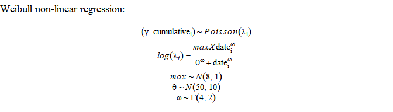

COVID-19 modeling in South Dakota
================
May 23, 2020

# Authors

*Jeff Wesner, Ph.D.*1, *Dan Van Peursem, Ph.D.*2,
*Jose Flores, Ph.D.*2,3, *Yuhlong Lio, Ph.D.*2

University of South Dakota

1Department of Biology, 2Department of
Mathematical Sciences, 3Department of Computer Science

<Jeff.Wesner@usd.edu>

# Purpose

To predict hospital bed needs, ICU needs, and ventilator needs in South
Dakota due to COVID-19.

# Updates

# Alternative Approach

## Directly modeling hospital bed use

Our previous approach attempted to estimate hospital bed use from an
initial SIR
(<https://github.com/jswesner/covid_sd/blob/master/code/alternative_analysis.pdf>).
However, there is now enough data to directly model the curve of
cumulative COVID related hospitalizations. To do that, we first used the
Weibull equation to fit a Bayesian non-linear curve to cumulative
hospitalization data (first graph below). We then converted that
cumulative prediction to active hospitalizations by varying the days in
the hospital to fit the data on active hospitalizations.

<!-- -->

Prior values for are loosely derived from from New York City’s
hospitalization curve in which \~ 0.4% of the population was
hospitalized. We used a poisson likelihood because the data are positive
counts and the variance is likely to increase with the mean.

## Weibull results

Results from the model suggest that South Dakota either has or shortly
will reach its peak in COVID-related hospitalizations at \~80 people
actively hospitalized.

<!-- -->

## Divergent trends outside of Minnehaha County

The above analysis makes predictions for the state of South Dakota, but
most of the early cases in the state happened in Minnehaha County. As
shown below, when we plot the hospitalization trends separately,
Minnehaha County appears to have nearly peaked in cumulative
hospitalizations while the rest of South Dakota is still in the
exponential phase of growth. To capture this dynamic, we re-fit the
model above but with separate random intercepts for each group (one for
Minnehaha County and one for the rest of South Dakota).

<!-- -->

## Influence of the priors

The plot below compares the prior predictive distribution (i.e. running
the model with only the prior information, not the data) to the
posterior predictive distribution. The large difference in these
predictions indicates that we learned a lot of information from the data
and the priors have relatively small influences.

<!-- -->
